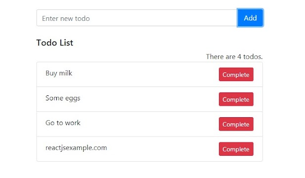
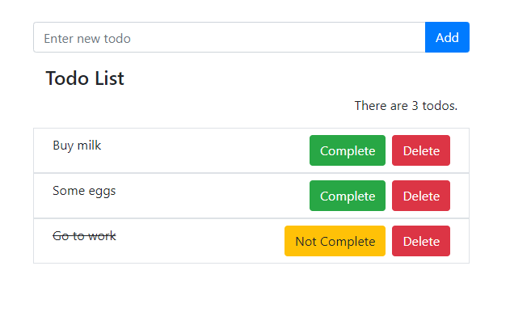

# Todo Uygulaması

### Kullanılan Kütüphaneler
* Uygulama React ile yazılmıştır.
* Uygulamada Redux-Toolkit kullanılmıştır.
* Uygulamada Bootstrap-4.6.1 kullanılmıştır.

----
### Uygulama fonksiyonları

- Uygulama içerisinde 4 farklı fonksiyona sahip buton vardır.

    - Add: Bu buton ile metin kutusuna yazılmış todo eklenebilmektedir.

    - Complete: Eklenmiş olan todoyu tamamlandı olarak işaretler ve todonun üzerini çizer.

    - Not Complete: Daha önce tamamlandı olarak işaretlenmiş ve üzeri çizilmiş olan todonun durumunu tekrar tamamlanmadıya çevirir ve yazının üzerindeki çizgiyi silerek eski haline çevirir.

    - Delete: Eklenmiş olan todoların istenilenlerinin silinebilmesine olanak sağlar ve todo listesinden kaldırır.

- Boş kayıt todo listesine eklenemez.
- Daha önce eklenmiş olan todo tekrar listeye eklenemez.
- Todo listesindeki elemanların "id" leri, liste içerisindeki en büyük id değerini bulup 1 artırarak oluşturulur.

---
### Uygulama yapısı  
Varsayılan olarak bazı veriler eklenmiştir (Paylaşılan örnek fotoğraftaki veriler).  

- Örnek uygulama aşağıdaki gibidir.  

    

  

- Geliştirilen uygulama aşağıda gösterilmiştir.  

    

